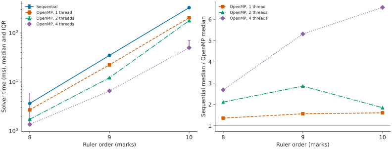

# Golomb ruler solver

**An order-10 Golomb ruler took 329.23 ms with the sequential solver and 50.17 ms with OpenMP on four threads**, using medians of five local WSL2 runs on an Intel i9-13900H. [Raw samples and environment](bench/results/wsl-2026-09-12/) accompany the comparison.

## Abstract

This project studies a bounded combinatorial search through sequential, shared-memory and distributed C++ implementations. A branch-and-bound search extends integer rulers while rejecting repeated differences and tightening a greedy upper bound. OpenMP tasks and MPI prefix distribution expose independent subtrees. The local experiment measures sequential and OpenMP solvers on orders eight through ten, with every returned ruler checked independently. The order-10 median ratio is 6.56 between the complete implementations; they explore different search trees, so this is not a measure of thread efficiency. Small MPI cases are also checked. One intermittent MPI result disagreed with its own reported length, which remains an unresolved correctness issue.

## Context and problem

A Golomb ruler has distinct positive differences between every pair of marks. The objective is to minimize its length, fixing the first mark at zero. Enumerating increasing mark combinations quickly becomes expensive; collision checks and bounds discard partial rulers that cannot improve the incumbent. This repository grew from academic HPC work using the Romeo cluster. Its [original reports and datasets](docs/archive.md) remain available as historical material.

For example, the sequential program returned `[0, 1, 4, 6]` for order four, with six distinct differences. That output is recorded in [the CLI checks](bench/results/validation/integration.json). Known lengths used as test oracles come from [OEIS A003022](https://oeis.org/A003022); the tests validate agreement with those reference values, not a new mathematical optimality proof.

## Approach

All variants keep a partial ruler, track used differences in a fixed bitset, and prune against the best length found. The sequential version is the comparison baseline. OpenMP creates tasks near the root and caches bounds in thread-local state. The MPI implementations distribute prefixes and communicate improved bounds.

| Variant | Execution model | Main tradeoff |
|---|---|---|
| v1 | Sequential branch-and-bound, optional AVX2 path | Baseline with no task scheduling |
| v2 | OpenMP tasks and local search state | Scheduling and stale bounds can change the work performed |
| v3 | MPI master/worker with OpenMP search | Central coordination and an unresolved inconsistent-result case |
| v4 | MPI prefix partitioning and hypercube bound exchange | Static subtree allocation can be uneven |


The [design notes](docs/design.md) explain state representation, synchronization tradeoffs and alternatives that have not been measured.

## Results

The retained campaign ran on 2026-09-12 from 05:07:06 to 05:07:16 UTC. Each configuration has one warmup followed by five measured fresh-process runs. Warmups are saved and excluded. Configuration order is shuffled each round using scheduling seed zero. The solver has no stochastic input; parallel scheduling can still change traversal order. Statistics are the median and inclusive first and third quartiles. All 72 outputs, including warmups, passed ruler and known-length checks.

| Order | Sequential median, Q1 to Q3 (ms) | OpenMP four-thread median, Q1 to Q3 (ms) | Sequential / OpenMP median |
|---|---:|---:|---:|
| G8 | 3.65, 3.62 to 3.66 | 1.36, 1.28 to 5.95 | 2.68 |
| G9 | 34.91, 34.90 to 35.15 | 6.57, 6.57 to 6.75 | 5.31 |
| G10 | 329.23, 325.33 to 332.93 | 50.17, 47.28 to 70.85 | 6.56 |

<picture>
  <source media="(prefers-color-scheme: dark)" srcset="docs/assets/local-benchmark-dark.svg">
  
</picture>

The left panel reports median solver time and the interquartile interval for five measurements per point. The right panel divides the sequential median by each OpenMP median; it does not estimate uncertainty in that ratio. The broad G8 and G10 four-thread intervals remain in the published data. Ratios above the thread count reflect different work as well as parallel execution: the raw samples retain explored and pruned node counts.

| Environment | Recorded value |
|---|---|
| CPU | Intel Core i9-13900H reported by WSL |
| Exposed topology | 20 logical CPUs, 10 cores and one socket reported by the VM |
| Available RAM | 16,537,264,128 bytes exposed to Linux |
| System | Ubuntu 24.04.4 LTS, Linux 6.6.87.2-microsoft-standard-WSL2, x86-64 |
| Compiler and build | GCC 13.3.0, GNU Make 4.3, C++17 |
| Compiler options | `-O3 -flto=auto -march=native -funroll-loops -falign-functions=32 -falign-loops=32 -fno-rtti -mavx2 -mfma -DUSE_AVX2`; v2 also `-fopenmp` |
| Runtime libraries | libgomp package `14.2.0-4ubuntu2~24.04.1`; OpenMPI 4.1.6 for separate correctness checks |
| Harness and plotting | Python 3.12.3, Matplotlib 3.10.6, NumPy 2.5.3; [complete plotting lockfile](bench/requirements.txt) |
| Placement | `OMP_DYNAMIC=FALSE`, `OMP_PLACES=cores`, `OMP_PROC_BIND=close`; explicit thread counts |
| Timing boundary | Solver construction, search and statistics retrieval; CSV resolution 0.01 ms |

The complete [environment record](bench/results/wsl-2026-09-12/environment.json) includes build flags and source hashes. [Detailed results](docs/results.md) include the one- and two-thread comparisons, validation failures and unmeasured claims. Host scheduling, CPU frequency and temperature were not controlled.

## What works

- All six tested build targets compiled under WSL: v1 through v4 and the v1/v2 targets without the explicit AVX2 implementation. [Build log](bench/results/validation/build.log).
- The existing component suites reported 58 common checks, 13 OpenMP checks and 30 MPI checks passing. [Unit-test log](bench/results/validation/unit-tests.log).
- The benchmark returned valid rulers of the reference lengths for every sequential/OpenMP sample at G8, G9 and G10. [Samples](bench/results/wsl-2026-09-12/samples.csv).
- The final CLI suite accepted all sequential, OpenMP and v4 cases, and three of its four v3 cases. It checks marks and differences as well as the printed length. [Complete checks](bench/results/validation/integration.json).

## What does not work

**v3 can print an inconsistent solution.** One four-rank, two-thread G7 run reported length 25 but returned marks ending at 26. Its process exit code was zero. The previous length-only CI check would accept that output; the new independent check rejects it. Twenty targeted reruns passed, so the defect is intermittent. The cause has not been established; consistency between the propagated bound and the returned mark vector needs investigation. [Failure and follow-up evidence](docs/results.md#validation-and-known-failure) are preserved. The solver logic is unchanged.

**Four-thread timing is variable for short searches.** The G8 interquartile interval crosses the sequential median, and G10 also varies. Task scheduling, traversal order and VM/host scheduling are possible contributors; their individual effects have not been isolated. A longer campaign on a controlled host is needed before making capacity or efficiency claims.

**Historical distributed scaling is not reproduced.** Multi-node performance, the archived v5 implementation and isolated SIMD gains are `not measured` (`non mesuré`): this session has no matching cluster allocation or v5 source, and did not run a SIMD ablation. Historical scripts still contain site-specific defaults. They are outside the local benchmark path.

**CI has a known correctness risk.** The local equivalent of the stronger CLI step returned failure for the v3 case above. Remote GitHub Actions has not been run for this unpublished branch. The workflow deliberately fails when a returned ruler is invalid; a later successful rerun does not resolve the known defect.

## Limits and scope

The fixed difference representation bounds the search domain; arbitrary-order support is not established. Agreement with known lengths on small cases does not prove correctness for every accepted input. MPI tests run on one machine and do not cover network failures, distributed deadlocks at scale or speedup across nodes.

The reported ratio compares two optimized implementations, both built with the same compiler options and explicit AVX2 support. It is not a pure parallel-efficiency measurement. WSL exposes virtual topology, and `-march=native` makes the generated binaries machine-specific. The `_noavx` target name removes the explicit AVX2 path while retaining that native compiler setting.

## Reproducibility

From a checkout containing this report, the following commands compile the solvers, measure fresh data and regenerate the figures. Linux or WSL with GCC, Make, OpenMPI and Python is required; Ubuntu's packages are `build-essential libopenmpi-dev openmpi-bin python3-venv`.

```bash
git clone https://github.com/Gotman08/Golomb.git
cd Golomb
make -j2 v1 v2 v3 v4 v1_noavx v2_noavx
make test_unit test_openmp_unit test_mpi_unit
python3 tests/check_cli.py

python3 -m venv .venv
.venv/bin/python -m pip install -r bench/requirements.txt
bash bench/run.sh --output bench/results/reproduction
.venv/bin/python bench/plot.py --input bench/results/reproduction
```

The CLI check can fail on the documented v3 defect. Its outputs remain in `build/validation/`. To regenerate the committed figure from the committed measurements, use:

```bash
.venv/bin/python bench/plot.py --input bench/results/wsl-2026-09-12
```

The runner refuses an existing output directory. Omit `--output` to create a timestamped run, or choose a fresh name. Run without competing compute jobs. Every raw sample retains phase, repetition, configuration, solver time, whole-process wall time, node counts, marks and validity. The input is a ruler order; no downloaded dataset is needed. Only the scheduling seed is fixed. See [the full protocol](docs/results.md#measurement-protocol).

## Installation and usage

`make all` builds the sequential and OpenMP variants. `make parallel` adds MPI variants when `mpicxx` is installed.

```bash
./build/golomb_v1 10
./build/golomb_v2 10 --threads 4
mpirun --oversubscribe -np 4 ./build/golomb_v4 8 --threads 2
```

Use `--csv FILE` to append solver output to a CSV file. Use `python3 tests/check_cli.py --v3-regression-runs 20 --output build/v3-regression` to exercise the known intermittent v3 case.

## Repository structure

```text
src/                 Solver implementations and shared validation/timing
include/golomb/      Search state, bitset, bounds and CSV interfaces
tests/               Component suites and independent CLI ruler checks
bench/               Measurement runner, plotting code and locked dependencies
bench/results/       Current raw measurements, environment and validation logs
docs/                Design, detailed results and historical report catalogue
docs/assets/         Regenerable SVG figures for light and dark themes
results/             Preserved historical Romeo data and canonical PNG figures
jobs/                Historical SLURM job configurations
scripts/             Existing local and cluster utilities
tools/visualization/ Historical plotting workflows
.github/workflows/   Ubuntu build and correctness checks
```

## Next steps

1. Reproduce and correct the v3 bound/mark inconsistency, then rerun the independent checker across rank and thread counts.
2. Repeat the local experiment on a controlled native host, recording affinity, frequency and a larger repetition count.
3. Run a dedicated SIMD ablation and instrument traversal differences before attributing gains to individual optimizations.
4. Restore the provenance needed for a new cluster campaign, including any historical implementation missing from this checkout.

## References

- [OEIS A003022](https://oeis.org/A003022): reference lengths for optimal Golomb rulers.
- [OpenMP specifications](https://www.openmp.org/specifications/): tasking and shared-memory execution semantics.
- [Open MPI 4.1 documentation](https://www.open-mpi.org/doc/v4.1/): MPI runtime and communication API reference.
- [Design decisions and historical material](docs/archive.md): repository-specific context and provenance.

## License

MIT, copyright 2025 Nicolas Marano. See [LICENSE](LICENSE).
