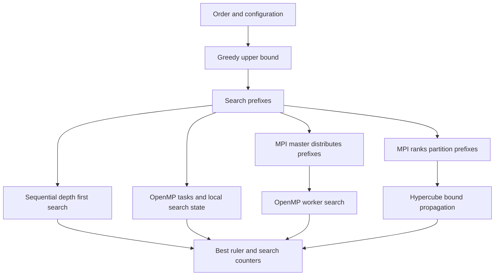

# Design and tradeoffs

This document describes the implementation at solver source revision `d533cab`. The portfolio update changes the measurement and documentation workflow; the solver sources and headers retain their original behavior.

## Search state

The search appends increasing integer marks to a partial ruler. A bitset records differences that have already been used. A proposed mark is rejected when one of its differences collides with that set. A greedy ruler supplies an initial upper bound. The search tightens the bound when it finds a shorter solution, and uses a lower bound on the remaining distance to prune branches that cannot improve it.

The implementation uses a fixed `BitSet256` and a fixed maximum order in [golomb.hpp](../include/golomb/golomb.hpp). This keeps copying and membership checks small, but bounds the representable problem. A dynamically sized bitset would support larger distances at the cost of a different memory layout. That alternative has not been implemented or benchmarked here.

The first nonzero mark is bounded using reflection symmetry. This reduces redundant exploration; no measured factor is attributed to that optimization. The report's small returned rulers are checked independently by [check_cli.py](../tests/check_cli.py), which enumerates all pairwise differences using Python integers.

## Parallel decomposition

| Choice in the code | Benefit it is intended to provide | Cost or alternative |
|---|---|---|
| Sequential branch-and-bound | A local baseline with the same problem definition | Exhaustive combinations would be simpler but would omit the pruning shared by these solvers |
| AVX2 difference checks | Process batches of differences | Hardware-specific binary; no isolated SIMD speedup is measured in this report |
| OpenMP tasks near the tree root | Expose subtrees while avoiding a task at every node | Unequal subtree sizes and task overhead remain |
| Thread-local cached bounds | Reduce reads of shared state | A stale bound can cause extra work; parallel runs can explore different node counts |
| MPI master/worker in v3 | Distribute prefix tasks dynamically | Coordination funnels through the master; the current report does not measure its scaling limit |
| Static prefix partitioning and hypercube exchange in v4 | Spread bound propagation among ranks | Static work assignment does not guarantee equal subtree costs; distributed scaling remains unmeasured |

These are implementation tradeoffs, not a claim that alternative designs were experimentally rejected. The comparison measures the complete v1 and v2 implementations. A ratio includes different traversal and scheduling behavior, and cannot isolate OpenMP overhead or SIMD alone.

## Measurement boundary

Both measured executables start their internal timer before constructing the solver, run the search, and obtain statistics before reading elapsed time. Printing and process creation are outside that timer. The existing CSV writer reports milliseconds to two decimal places. The external harness also records whole-process wall time, but the figures use the solver's internal time consistently.

The benchmark invokes each solver in a fresh process. One warmup per configuration is retained and excluded from statistics. The following measured rounds shuffle the configuration order with a fixed scheduling seed. Solver source hashes, compiler flags, runtime versions and the full output accompany the samples.

## Boundaries left unchanged

The update introduces no new pruning rule, synchronization change, search limit or CLI behavior. The existing build still uses `-march=native`; the `_noavx` targets omit the explicit AVX2 implementation but do not promise a binary portable to another CPU. MPI validation uses processes on one WSL machine and does not exercise a cluster network. The historical cluster deployment scripts remain environment-specific.
